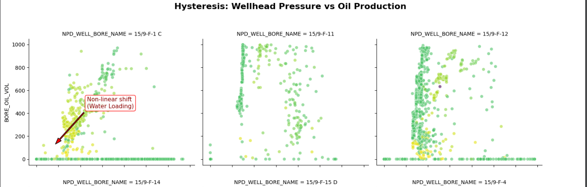
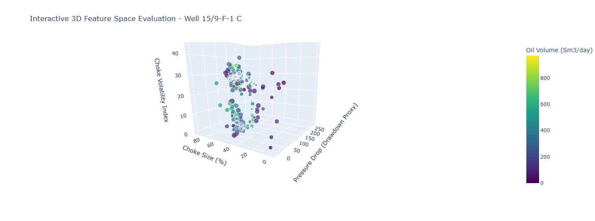

<div align="center">

# 🛢️ PDSEAA Practice Project 1
## Petroleum Production Data Analysis

### Physics-Informed Data Cleaning, Feature Engineering & Exploratory Data Analysis


</div>

---

# 📖 Overview

This repository contains my solution to **Practice Project 1** from the **Petroleum Data Science and Engineering Analytics Academy (PDSEAA)**.

The objective of this project was to develop a complete **data preprocessing and exploratory analytics pipeline** for petroleum production data before machine learning model development.

Instead of jumping directly into predictive modelling, this project focuses on building a **high-quality, physics-informed dataset** through robust data cleaning, feature engineering, and validation techniques. The resulting dataset is suitable for downstream applications such as oil production forecasting, production optimization, and well downtime prediction.

---

# 🎯 Project Objectives

The project addresses common challenges encountered in real petroleum production datasets by:

- Cleaning noisy production data
- Detecting shut-in periods
- Identifying sensor anomalies
- Handling missing and corrupted measurements
- Applying physics-informed data validation
- Engineering production-related features
- Exploring feature relationships through visualization
- Preparing an ML-ready dataset

---

# 🛢 Dataset

The project uses the **Volve Field Production Dataset**, containing historical production records from multiple wellbores.

Key variables include:

- Wellhead Pressure
- Downhole Pressure
- Oil Production
- Gas Production
- Water Production
- Choke Size
- Production Hours
- Well Identification
- Production Dates

---

# 🛠 Technologies Used

- Python
- Pandas
- NumPy
- Scikit-learn
- Matplotlib
- Seaborn
- Plotly
- Jupyter Notebook

---

# ⚙️ Project Workflow

## Phase 1 — Data Sanitization

The first stage focuses on producing a physically consistent dataset.

### Completed Tasks

✔ Shut-in production filtering

✔ Sensor anomaly detection

✔ Text formatting cleanup

✔ NULL value handling

✔ Dead sensor identification

✔ Physics-informed pressure reconstruction

The cleaning process ensures that impossible operating conditions are removed before feature engineering.

---

## Phase 2 — Physics-Informed Feature Engineering

New engineering features were developed to better represent reservoir and production system behaviour.

### Engineered Features

- Tubing Pressure Drop
- Static Reservoir Pressure Proxy
- Drawdown Proxy
- Water Cut
- Choke Size Lag Features
- Choke Volatility Index

These engineered variables improve the physical representation of production behaviour and provide informative inputs for future machine learning models.

---

## Phase 3 — Exploratory Data Analysis (EDA)

The cleaned dataset was explored to identify production trends, operational behaviour, and feature relationships.

Visualizations include:

- Wellhead Pressure vs Oil Production
- Multi-well production comparison
- Water Cut analysis
- Pressure regime mapping
- Hysteresis behaviour
- Feature interaction plots

---

## Phase 4 — Interactive Feature Space Evaluation

An interactive Plotly dashboard was developed to evaluate multidimensional feature relationships.

Features visualized include:

- Pressure Drop
- Choke Size
- Choke Volatility Index
- Oil Production
- Water Cut

The interactive visualization allows easier exploration of production behaviour across different operational regimes.

---

# 📸 Results & Visualizations

## Hysteresis Analysis

The figure below illustrates the relationship between **Wellhead Pressure** and **Oil Production** across multiple wellbores.

Marker colours represent **Water Cut**, helping identify production regime changes and nonlinear behaviour caused by increased water loading.

<p align="center">

</p>

---

## Interactive 3D Feature Space

A Plotly-based interactive visualization was created to investigate relationships among engineered production features.

Axes:

- X → Pressure Drop
- Y → Choke Size
- Z → Choke Volatility Index

Colour Scale:

- Oil Production

Bubble Size:

- Water Cut

<p align="center">

</p>

---

# 📊 Key Achievements

✅ Removed physically inconsistent production records

✅ Detected shut-in production windows

✅ Identified sensor calibration errors

✅ Applied physics-informed feature engineering

✅ Constructed reservoir pressure proxies

✅ Generated time-series lag features

✅ Developed interactive production analytics

✅ Produced an ML-ready dataset

---

# 📂 Repository Structure

```
pdseaa-petroleum-production-data-analysis
│
├── Akindutire_Practice_Project_PDSEAA_solution.ipynb
├── README.md
├── Volve_daily_production.csv
└── Volve_monthly_production.csv
└── hysteresis_plot.png
└── feature_space_3d.png
```

---

# 🚀 Getting Started

## Clone the repository

```bash
git clone https://github.com/YOUR_USERNAME/pdseaa-petroleum-production-data-analysis.git
```

---

## Navigate into the project

```bash
cd pdseaa-petroleum-production-data-analysis
```

---

## Install dependencies

```bash
pip install pandas numpy matplotlib seaborn plotly scikit-learn
```

---

## Launch Jupyter Notebook

```bash
jupyter notebook
```

Open:

```
Akindutire_Practice_Project_PDSEAA_solution.ipynb
```

---

# 💡 Skills Demonstrated

This project demonstrates proficiency in:

- Data Cleaning
- Data Wrangling
- Exploratory Data Analysis
- Feature Engineering
- Petroleum Production Analytics
- Reservoir Engineering Concepts
- Physics-Informed Data Processing
- Interactive Data Visualization
- Python Programming
- Scientific Computing

---

# 🔮 Future Improvements

Potential future work includes:

- Oil production prediction models
- Well downtime prediction
- Production forecasting
- Feature selection
- Hyperparameter optimization
- Machine learning model deployment
- Streamlit dashboard integration

---

# 📚 Learning Outcomes

Through this project, I gained practical experience in:

- Preparing real-world production datasets
- Handling noisy industrial sensor data
- Applying engineering principles during feature engineering
- Building reproducible data science workflows
- Creating interactive visualizations for production analytics

---

# 👨‍💻 Author

## **Akindutire Emmanuel**

**Metallurgical & Materials Engineer**

Interests:

- Petroleum Data Science
- Corrosion Engineering
- Asset Integrity
- Machine Learning
- Production Analytics
- Energy Systems

📧 Email: akindutiremmanuel@gmail.com

🔗 LinkedIn: https://www.linkedin.com/in/akindutiremmanuel/

---

# 🙏 Acknowledgements

This project was completed as part of **Practice Project 1** in the **Petroleum Data Science and Engineering Analytics Academy (PDSEAA)**.

Special appreciation to the PDSEAA instructors and mentors for designing practical, industry-relevant projects that bridge petroleum engineering and data science.

---

# ⭐ Support

If you found this repository useful, please consider giving it a **Star ⭐**.

Feedback, suggestions, and contributions are always welcome!

---

## 📜 License

This project is intended for educational and research purposes.
